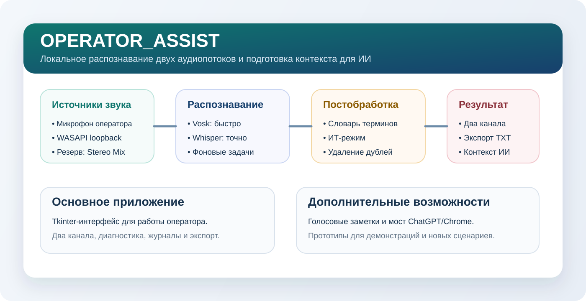
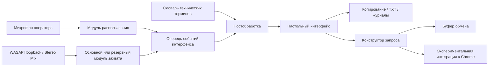

# OPERATOR_ASSIST

**Русский** | [English](README.en.md)

<p align="center">
  
</p>

[](https://github.com/YuryGorshkov/OPERATOR_ASSIST/actions/workflows/ci.yml)


Windows-ассистент оператора для раздельной расшифровки двух аудиопотоков: микрофона оператора и речи собеседника или системного звука. Приложение локально распознаёт русскую речь, экспортирует расшифровку и готовит контекст для ИИ-подсказок.

## Кратко о проекте

| Область | Текущая реализация | Статус |
| --- | --- | --- |
| Настольное приложение | Интерфейс Tkinter с отдельными панелями оператора и собеседника | Основная функция |
| Захват аудио | Микрофон, WASAPI loopback или резервный источник записи | Основная функция |
| Распознавание речи | Быстрый локальный Vosk и переключаемые модели Whisper | Основная функция |
| Передача в ИИ | Копирование и экспорт контекста, экспериментальная интеграция с Chrome | Дополнительно |
| Браузерные версии | Прототипы голосовых заметок и одноканального распознавания | Прототип |
| Распространение | Portable-архив, установщик, GitHub Releases и CI | Доступно |
| Лаборатория распознавания | Офлайн-сравнение профилей на проверенных парах аудио и текста | Инструмент разработки |

## Обзор

`OPERATOR_ASSIST` решает практическую задачу работы оператора в Windows:

- оператор говорит в микрофон гарнитуры;
- речь собеседника поступает через отдельный аудиоканал;
- оба потока должны отображаться раздельно;
- расшифровка должна быть сразу готова к дальнейшей работе;
- основные функции не должны зависеть от облачных сервисов.

Репозиторий содержит всё необходимое для устойчивой работы на реальном компьютере: маршрутизацию аудио, локальное распознавание речи, диагностику каналов, упаковку приложения и воспроизводимую установку.

## Демонстрация



## Основные возможности

- Одновременное распознавание микрофона и речи собеседника или системного звука в отдельных панелях.
- Офлайн-распознавание русской речи: быстрый Vosk или модели `faster-whisper large-v3` / `large-v3-turbo` для канала собеседника.
- Выбор активных каналов: оба, только собеседник или только оператор.
- Поиск источника, через который в данный момент поступает системный звук.
- Автоматическое обнаружение WASAPI loopback с резервным переходом на классические источники записи, например Stereo Mix.
- Проверка наличия моделей, выбранных источников и сохранённых настроек перед первым запуском.
- Копирование расшифровки, экспорт в TXT и ведение журналов.
- Нормализация технических терминов с переключаемым ИТ-словарём.
- Формирование запроса на основе расшифровки речи собеседника.
- Экспериментальная передача подготовленного запроса на страницу ChatGPT через Chrome.
- Облегчённые браузерные прототипы для голосовых заметок и одноканального распознавания.

## Почему система устроена так

- Маршрутизация звука в Windows сильно зависит от оборудования и драйверов, поэтому приложение показывает диагностику каналов, а не полагается на один заранее заданный источник.
- Локальное распознавание сохраняет работоспособность без API и внешних квот: Vosk быстрее запускается, а Whisper обеспечивает более высокую точность.
- Потоковый режим Whisper ориентируется на обнаруженные паузы и распределяет слова на пересекающихся границах по временным меткам. Это надёжнее слепой нарезки на интервалы и текстового удаления дублей.
- Исправление технической лексики выполняется прозрачным детерминированным постпроцессингом, поскольку одной сырой модели распознавания не всегда достаточно.
- Экспериментальная интеграция с ИИ отделена от стабильного настольного ядра, чтобы основной сценарий оставался понятным и тестируемым.

## Архитектура



Подробнее: [docs/architecture.md](docs/architecture.md)

## Лаборатория качества распознавания

Дополнительные консольные инструменты `asr_lab` позволяют сравнивать настройки распознавания на одном и том же корпусе аудио и текста, проверенном человеком, не изменяя настольное приложение. Профиль с фиксированными окнами `baseline` остаётся неизменным для воспроизводимости, а `production_pause` повторяет текущую логику рабочего движка. В остальных экспериментах за один запуск меняется только один фактор.

Отчёты содержат WER/CER, исходную и нормализованную расшифровки, покрытие терминологии и время офлайн-обработки. Инструменты также умеют преобразовывать разрешённые аудиофайлы и экспортировать парные данные для обучения, но не записывают устройства, не обучают модели и не загружают веса автоматически.

Рабочий профиль точного потокового распознавания был выбран на небольшом многоголосовом корпусе, проверенном человеком, и повторно протестирован на сохранённой контрольной записи. Эти результаты подтверждают выбор профиля для текущего приложения, но не являются универсальной гарантией точности. Дообучение моделей не выполнялось. Личные записи, исходные книги, отчёты и контрольные точки остаются локальными и исключены из Git.

Описание процесса и ограничений: [docs/recognition-lab.md](docs/recognition-lab.md)

## Компоненты и точки запуска

| Компонент | Точка входа | Назначение |
| --- | --- | --- |
| Настольный ассистент оператора | `operator_assist.py` | Основной сценарий Windows с двумя каналами и коррекцией технических терминов |
| Среда с поддержкой loopback | `operator_assist_chat_bridge_v5_base.py` | WASAPI loopback и выбор источников Windows |
| Общий пакет приложения | `operator_assist_runtime/base_runtime.py` | Движок распознавания, интерфейс, поток расшифровки и проверка готовности |
| Экспериментальный мост Chrome | `operator_assist_chat_window_test.py` | Передача запроса в ChatGPT через режим удалённой отладки Chrome |
| Браузерные голосовые заметки | `app/index.html` | Облегчённая запись заметок через Web Speech API |
| Браузерная расшифровка собеседника | `app/speaker.html` | Облегчённое одноканальное распознавание речи |

## Структура репозитория

```text
OPERATOR_ASSIST/
├─ .github/workflows/                CI и автоматизация выпусков по тегам
├─ app/                              Браузерные прототипы
├─ assets/                           Иконки и логотипы
├─ backups/                          Слой совместимости со старыми точками входа
├─ docs/                             Архитектура, установка, выпуск и демонстрация
├─ operator_assist_runtime/          Общий пакет рабочего приложения
├─ packaging/                        Конфигурация PyInstaller и Inno Setup
├─ scripts/                          Скрипты сборки, установки и проверки среды
├─ tests/                            Модульные тесты репозитория и приложения
├─ vendor/                           Локальные зависимости для Windows loopback
├─ operator_assist.py                Основная точка входа настольного приложения
├─ operator_assist_chat_bridge_v5_base.py
├─ operator_assist_chat_window_test.py
├─ pyproject.toml
├─ requirements.txt
├─ custom_terms.txt
└─ technical_terms.json
```

## Быстрый старт

### Вариант A: установка из GitHub Release

1. Откройте раздел [Releases](https://github.com/YuryGorshkov/OPERATOR_ASSIST/releases).
2. Скачайте `OPERATOR_ASSIST-Setup-<version>.exe` или `OPERATOR_ASSIST-portable-<version>.zip`.
3. Установите приложение или распакуйте архив.
4. Поместите поддерживаемую модель Vosk в каталог `data/models/`.
5. Запустите приложение и выберите нужные каналы. Если источник системного звука неочевиден, включите тестовое аудио и нажмите `Найти звук`.
6. Выберите `Точный (Whisper)`, затем `Максимальная точность (large-v3)` для сложной речи и акцентов либо более компактный `Быстрый режим (large-v3-turbo)`, если важнее скорость отклика. Каждая модель подготавливается только при первом использовании.
7. Для Whisper выберите `Видеокарта (GPU/CUDA)`, чтобы получить максимальную производительность на совместимой видеокарте, или `Процессор (CPU)`, если видеокарта слабая либо не поддерживается.

Во время длинных реплик Whisper приглушённая строка под основным полем показывает быстрый предварительный результат. Основной текст содержит более точную финальную версию; только она используется при копировании и экспорте в TXT.

Кнопка `Словарь` предназначена для имён и специальных терминов, которые распознаватель регулярно записывает неправильно. Добавляйте по одному точному правилу в строке в формате `как распознано = как должно быть`. Сохранённые правила загружаются при следующем нажатии `Старт` и не вмешиваются в декодирование Whisper.

Подробнее: [docs/install-from-release.md](docs/install-from-release.md)

### Вариант B: запуск из исходного кода

#### 1. Установите Python 3.10

Настольное приложение разработано и проверено с Python `3.10.x`.

#### 2. Клонируйте репозиторий

```powershell
git clone https://github.com/YuryGorshkov/OPERATOR_ASSIST.git
cd OPERATOR_ASSIST
```

#### 3. Запустите установочный помощник Windows

```text
Setup-From-Git.cmd
```

Эквивалентная команда PowerShell:

```powershell
powershell.exe -NoProfile -ExecutionPolicy Bypass -File .\scripts\Setup-From-Git.ps1
```

Установщик создаёт локальное окружение `.venv`, устанавливает зависимости, подготавливает рабочие каталоги и выполняет предварительную проверку.

#### 4. Добавьте модель Vosk

Поместите одну из поддерживаемых русских моделей в локальный каталог `models/`. Приложение проверяет следующие пути:

- `models/vosk-model-ru-0.42`
- `models/vosk-model-ru-0.22`
- `models/vosk-model-small-ru-0.22`

#### 5. Запустите настольное приложение

Командный файл Windows:

```text
Run-Operator-Assist.cmd
```

Основная точка входа Python:

```powershell
python .\operator_assist.py
```

#### 6. Проверьте готовность к первому запуску

Если модель распознавания ещё не найдена, приложение показывает блок готовности вместо серии модальных ошибок.

Быстрые действия в интерфейсе позволяют:

- открыть локальный каталог моделей;
- повторить стартовую проверку;
- проверить маршрутизацию микрофона и канала собеседника или системного звука;
- убедиться, что оба канала работают, прежде чем нажимать `Старт`.

Подробнее:

- [docs/first-launch.md](docs/first-launch.md)
- [docs/install-from-git.md](docs/install-from-git.md)

#### 7. Запустите браузерные прототипы

Запустите локальный сервер для каталога `app/`:

```powershell
powershell.exe -ExecutionPolicy Bypass -File .\scripts\Serve-App-Tcp.ps1
```

Затем откройте:

- `http://127.0.0.1:8765/`
- `http://127.0.0.1:8765/speaker.html`

## Проверка проекта

Проверка окружения:

```powershell
powershell.exe -ExecutionPolicy Bypass -File .\scripts\Check-Environment.ps1
```

Запуск тестов репозитория:

```powershell
python -m unittest discover -s tests -v
```

## Сборка и выпуск

Установка инструментов сборки:

```powershell
pip install .[build]
```

Сборка выпуска:

```powershell
powershell.exe -ExecutionPolicy Bypass -File .\scripts\Build-Release.ps1
```

Процесс выпуска:

- запускает тесты репозитория;
- собирает приложение PyInstaller в формате one-folder;
- формирует переносимую структуру Windows-приложения;
- создаёт версионный portable-архив;
- собирает установщик Inno Setup, если доступен `ISCC.exe`;
- публикует выпуски по тегам через `.github/workflows/release.yml`.

Основные результаты сборки:

- `release/portable/OPERATOR_ASSIST`
- `release/publish/OPERATOR_ASSIST-portable-<version>.zip`
- `release/publish/OPERATOR_ASSIST-Setup-<version>.exe`
- `release/publish/SHA256SUMS.txt`

## Инженерные решения

### Локальное распознавание вместо облачного

Основной сценарий оптимизирован для конфиденциальности, предсказуемой задержки и независимости от квот внешних API.

### Модульная среда вместо одного монолитного скрипта

Репозиторий разделён на:

- общий пакет рабочего приложения;
- настольную оболочку с поддержкой Windows loopback;
- слой обработки ИТ-терминологии;
- изолированный эксперимент интеграции с Chrome.

Такое разделение не смешивает стабильный путь распознавания с экспериментальными сценариями.

### Детерминированная нормализация терминологии

В технической поддержке и собеседованиях коррекция типичных отраслевых терминов иногда полезнее замены распознавателя. ИТ-режим реализован как управляемый слой постобработки, а не как скрытая логика подсказок.

### Практичная переносимость в Windows

Часть зависимостей loopback хранится в репозитории, поскольку аудиомаршрутизация Windows является одной из самых непредсказуемых частей установки. Это осознанный выбор в пользу воспроизводимого локального поведения.

## Текущие ограничения

- Основной настольный сценарий предназначен для Windows.
- Данные моделей Vosk и Whisper являются внешними ресурсами и не включаются в Git или выпуски.
- Интеграция с Chrome является дополнительной и экспериментальной.
- Автоматические проверки охватывают детерминированную логику и контракты репозитория, но не реальные аудиозаписи.
- Исполняемые файлы Windows не имеют цифровой подписи, поэтому на новых компьютерах возможно предупреждение SmartScreen.

## Документация

- [docs/architecture.md](docs/architecture.md)
- [docs/case-study.md](docs/case-study.md)
- [docs/demo-script.md](docs/demo-script.md)
- [docs/deployment.md](docs/deployment.md)
- [docs/first-launch.md](docs/first-launch.md)
- [docs/install-from-git.md](docs/install-from-git.md)
- [docs/install-from-release.md](docs/install-from-release.md)
- [docs/known-issues.md](docs/known-issues.md)
- [docs/recognition-lab.md](docs/recognition-lab.md)
- [docs/smoke-checklist.md](docs/smoke-checklist.md)
