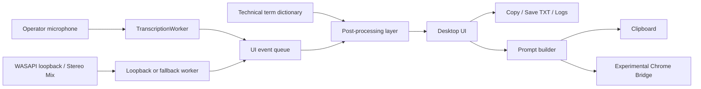

# OPERATOR_ASSIST

<p align="center">
  
</p>

[](https://github.com/YuryGorshkov/OPERATOR_ASSIST/actions/workflows/ci.yml)


Windows-first desktop assistant for dual-stream transcription: one channel for the operator microphone, one channel for caller or system audio, with offline Russian speech recognition, transcript export, and optional AI handoff tooling.

## At A Glance

| Area | Current implementation | Status |
| --- | --- | --- |
| Desktop runtime | Tkinter app with separate operator and speaker panes | Primary |
| Audio capture | Microphone plus WASAPI loopback or fallback recording input | Primary |
| Speech recognition | Fast local Vosk plus optional `faster-whisper large-v3` | Primary |
| Prompt handoff | Copy/export workflow plus optional Chrome injection experiment | Optional |
| Browser surfaces | Voice notes and single-stream speaker prototypes | Prototype |
| Distribution | Portable zip, installer build, GitHub Releases, CI | Available |

## Repository Overview

`OPERATOR_ASSIST` was built around a practical Windows workflow problem:

- the operator speaks into a headset microphone,
- the other side of the conversation arrives through a different audio path,
- both streams need to remain visible,
- transcript text needs to be reusable immediately,
- local deployment matters more than cloud dependency.

The repository focuses on the engineering needed to make that workflow usable on a real Windows machine: audio routing, local STT, operator-facing diagnostics, packaging, and repeatable setup.

## Showcase


## Core Capabilities

- Simultaneous transcription of microphone audio and speaker or system audio into separate panels.
- Offline Russian speech recognition using fast Vosk or high-accuracy `faster-whisper large-v3` for the caller channel.
- Selectable capture modes for both channels, caller only, or operator only.
- Live source probe that identifies the input currently carrying system audio.
- Automatic WASAPI loopback discovery with fallback to classic recording inputs such as Stereo Mix.
- First-launch readiness checks for model presence, source selection, and saved settings.
- Local transcript copy, TXT export, and logging.
- Technical-term normalization with a switchable IT vocabulary mode.
- Prompt assembly workflow based on the speaker transcript.
- Optional Chrome handoff experiment for sending the prepared prompt into a ChatGPT page.
- Lightweight browser prototypes for single-stream notes and speaker-text capture.

## Why The Design Looks Like This

- Windows audio routing varies heavily across machines, so the app exposes capture diagnostics instead of assuming one fixed hardware path.
- Local speech recognition keeps the main workflow usable without API quotas; Vosk favors startup speed while Whisper favors accuracy.
- Technical vocabulary correction is handled as deterministic post-processing rather than pretending raw STT is always enough.
- Experimental AI handoff stays separate from the core desktop runtime so the stable path remains understandable and testable.

## System Architecture



More detail: [docs/architecture.md](docs/architecture.md)

## Runtime Surfaces

| Surface | Entry point | Purpose |
| --- | --- | --- |
| Desktop operator assistant | `operator_assist.py` | Main Windows workflow with dual transcription and IT-mode corrections |
| Loopback-enabled runtime | `operator_assist_chat_bridge_v5_base.py` | WASAPI loopback support and Windows source selection |
| Shared runtime package | `operator_assist_runtime/base_runtime.py` | Recognition engine, UI orchestration, transcript flow, startup readiness |
| Chrome bridge experiment | `operator_assist_chat_window_test.py` | Prompt injection into ChatGPT through Chrome remote debugging |
| Browser voice notes | `app/index.html` | Lightweight note capture using Web Speech API |
| Browser speaker text | `app/speaker.html` | Lightweight single-stream speaker transcription |

## Repository Layout

```text
OPERATOR_ASSIST/
├─ .github/workflows/                CI and tagged release automation
├─ app/                              Browser prototypes
├─ assets/                           Icons and logo assets
├─ backups/                          Compatibility shim for older local entry points
├─ docs/                             Architecture, setup, deployment, and demo notes
├─ operator_assist_runtime/          Shared runtime package
├─ packaging/                        PyInstaller and Inno Setup files
├─ scripts/                          Build, bootstrap, environment, and helper scripts
├─ tests/                            Repository and runtime unit tests
├─ vendor/                           Vendored Windows loopback dependencies
├─ operator_assist.py                Main desktop entry point
├─ operator_assist_chat_bridge_v5_base.py
├─ operator_assist_chat_window_test.py
├─ pyproject.toml
├─ requirements.txt
└─ technical_terms.json
```

## Quick Start

### Option A: Install from GitHub Release

1. Open [Releases](https://github.com/YuryGorshkov/OPERATOR_ASSIST/releases).
2. Download either `OPERATOR_ASSIST-Setup-<version>.exe` or `OPERATOR_ASSIST-portable-<version>.zip`.
3. Install or extract the package.
4. Place one supported Vosk model into `data/models/`.
5. Start the app, choose the required channels, and use `Найти звук` while test audio is playing if the system route is unclear.
6. Choose `Точный (Whisper)` for maximum caller accuracy; its model cache is prepared on first use.

More detail: [docs/install-from-release.md](docs/install-from-release.md)

### Option B: Run from source

#### 1. Install Python 3.10

The desktop runtime was developed against Python `3.10.x`.

#### 2. Clone the repository

```powershell
git clone https://github.com/YuryGorshkov/OPERATOR_ASSIST.git
cd OPERATOR_ASSIST
```

#### 3. Run the Windows bootstrap helper

```text
Setup-From-Git.cmd
```

Equivalent PowerShell command:

```powershell
powershell.exe -NoProfile -ExecutionPolicy Bypass -File .\scripts\Setup-From-Git.ps1
```

This setup creates a project-local `.venv`, installs dependencies, prepares local folders, and runs a preflight check.

#### 4. Add a Vosk model

Place one supported Russian model under the local `models/` directory. The runtime checks these paths:

- `models/vosk-model-ru-0.42`
- `models/vosk-model-ru-0.22`
- `models/vosk-model-small-ru-0.22`

#### 5. Launch the desktop app

Windows launcher:

```text
Run-Operator-Assist.cmd
```

Main Python entry point:

```powershell
python .\operator_assist.py
```

#### 6. Review first-launch readiness

If the app cannot find a speech model yet, it shows a readiness block instead of failing only through modal errors.

Use the in-app quick actions to:

- open the local model folder,
- re-run startup checks,
- confirm microphone and caller or system-audio routing,
- verify both channels before pressing `Старт`.

More detail:

- [docs/first-launch.md](docs/first-launch.md)
- [docs/install-from-git.md](docs/install-from-git.md)

#### 7. Launch the browser prototypes

Serve the local `app/` directory:

```powershell
powershell.exe -ExecutionPolicy Bypass -File .\scripts\Serve-App-Tcp.ps1
```

Then open:

- `http://127.0.0.1:8765/`
- `http://127.0.0.1:8765/speaker.html`

## Validation

Run the environment preflight:

```powershell
powershell.exe -ExecutionPolicy Bypass -File .\scripts\Check-Environment.ps1
```

Run repository tests:

```powershell
python -m unittest discover -s tests -v
```

## Release And Packaging

Build-time tooling:

```powershell
pip install .[build]
```

Release build:

```powershell
powershell.exe -ExecutionPolicy Bypass -File .\scripts\Build-Release.ps1
```

The release pipeline:

- runs repository tests,
- builds a PyInstaller one-folder bundle,
- assembles a portable Windows release layout,
- creates a versioned portable zip,
- builds an Inno Setup installer when `ISCC.exe` is available,
- publishes tagged releases through `.github/workflows/release.yml`.

Typical outputs:

- `release/portable/OPERATOR_ASSIST`
- `release/publish/OPERATOR_ASSIST-portable-<version>.zip`
- `release/publish/OPERATOR_ASSIST-Setup-<version>.exe`
- `release/publish/SHA256SUMS.txt`

## Engineering Notes

### Local STT instead of cloud STT

The main workflow is optimized for privacy, latency, and independence from external API quotas.

### Layered runtime instead of one monolithic script

The repository evolved toward:

- a shared runtime package,
- a Windows loopback-aware desktop wrapper,
- an IT terminology wrapper,
- an isolated Chrome handoff experiment.

That split keeps the stable transcription path separate from workflow experiments.

### Deterministic terminology normalization

For support and interview-style technical conversations, common-domain correction can deliver more value than swapping recognizers. IT mode is implemented as a controlled post-processing layer rather than hidden prompt logic.

### Practical Windows portability

Some loopback dependencies are vendored because the Windows audio path is one of the least predictable parts of the setup. This is an explicit trade-off in favor of reproducible local behavior.

## Current Constraints

- Primary desktop workflow is Windows-first.
- Vosk and Whisper model data are external runtime assets and are not bundled in git or releases.
- The Chrome bridge is optional and experimental.
- Automated checks cover deterministic logic and repository contracts, not real audio fixtures.
- Windows binaries are unsigned, so SmartScreen warnings are still possible on fresh machines.

## Documentation Map

- [docs/architecture.md](docs/architecture.md)
- [docs/case-study.md](docs/case-study.md)
- [docs/demo-script.md](docs/demo-script.md)
- [docs/deployment.md](docs/deployment.md)
- [docs/first-launch.md](docs/first-launch.md)
- [docs/install-from-git.md](docs/install-from-git.md)
- [docs/install-from-release.md](docs/install-from-release.md)
- [docs/known-issues.md](docs/known-issues.md)
- [docs/smoke-checklist.md](docs/smoke-checklist.md)
