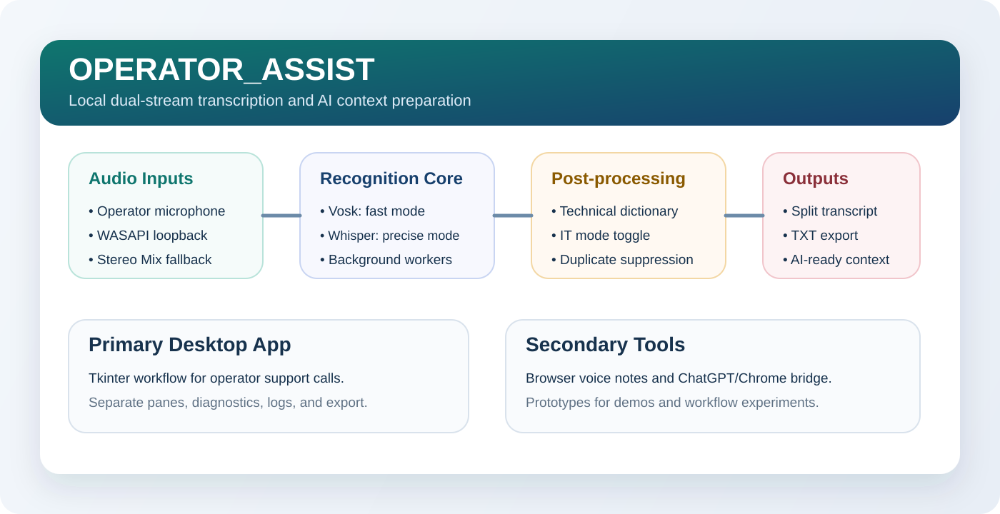
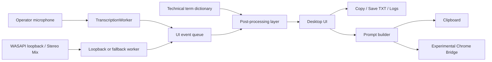

# OPERATOR_ASSIST

[](https://github.com/YuryGorshkov/OPERATOR_ASSIST/actions/workflows/ci.yml)


Windows-first real-time speech tooling for operator workflows, voice note capture, and AI-assisted prompt preparation.

`OPERATOR_ASSIST` is a product-style repository built around a practical problem: splitting speech streams in live conversations, transcribing them with local Russian speech recognition, and turning the result into something an operator can immediately use.

The project combines:

- a native desktop runtime for dual-stream transcription,
- a domain-specific technical-term correction layer,
- an experimental ChatGPT/Chrome bridge,
- browser-based voice note and speaker-text prototypes for lighter use cases.

Desktop UI is currently Russian-first. Repository documentation is English-first so the project is easier to review in a public repository.

## Showcase



## Why This Project Is Interesting

- It solves a real UX problem, not a toy CRUD task: one stream is the operator microphone, the other is the system or caller audio path.
- It handles a non-trivial Windows audio capture problem using WASAPI loopback with fallback paths.
- It separates product surfaces: desktop workflow, prompt-building workflow, and browser-first lightweight prototypes.
- It uses an explicit post-processing layer for technical terminology instead of pretending raw STT output is always good enough.
- It keeps large runtime assets and local operator data out of git, which is closer to how a real desktop tool is maintained.

## What This Demonstrates

- Desktop product thinking instead of script-only automation.
- Pragmatic Windows audio engineering with multiple fallback paths.
- Incremental architecture cleanup from legacy wrappers toward shared runtime services.
- Public-repo hardening: CI, release automation, packaging assets, tests, and documentation.
- Honest scope control: stable workflow separated from experimental AI handoff features.

## Core Capabilities

- Simultaneous transcription of microphone audio and speaker/system audio into separate panels.
- Offline Russian speech recognition using Vosk models.
- Automatic detection of WASAPI loopback sources, with fallback to classic recording inputs such as Stereo Mix.
- First-launch readiness checks for model presence, audio sources, and saved settings.
- Technical-term normalization layer with switchable IT terminology mode.
- Transcript export, clipboard copy, and local logging.
- Prompt assembly workflow for AI assistance based on the caller stream.
- Experimental Chrome bridge that can inject prepared prompts into a ChatGPT session.
- Lightweight browser prototypes for voice notes and a single-stream speaker-text window.

## System Architecture



More detail: [docs/architecture.md](docs/architecture.md)

## Runtime Modes

| Mode | Entry point | Purpose | Status |
| --- | --- | --- | --- |
| Desktop operator assistant | `operator_assist.py` | Main product workflow with IT mode and dual transcription UX | Primary |
| Desktop loopback wrapper | `operator_assist_chat_bridge_v5_base.py` | Adds WASAPI loopback capture and Windows audio source selection | Primary dependency |
| Base runtime | `operator_assist_runtime/base_runtime.py` | Core recognition engine, UI queue, transcript handling, prompt builder | Primary dependency |
| Chrome bridge experiment | `operator_assist_chat_window_test.py` | Prompt injection into ChatGPT via Chrome remote debugging | Experimental |
| Browser voice notes | `app/index.html` | Lightweight voice-note UI using Web Speech API | Prototype |
| Browser speaker window | `app/speaker.html` | Lightweight speaker-text UI using Web Speech API | Prototype |

## Repository Layout

```text
OPERATOR_ASSIST/
├─ .github/
│  └─ workflows/
│     ├─ ci.yml                     GitHub Actions validation for syntax and lightweight tests
│     └─ release.yml                Tagged Windows release build and publication
├─ app/                               Browser prototypes (voice notes + speaker window)
├─ assets/                            App icon and logo assets used by runtime and packaging
├─ operator_assist_runtime/
│  ├─ __init__.py
│  ├─ base_runtime.py
│  ├─ runtime_paths.py
│  ├─ startup_readiness.py
│  ├─ technical_terms.py
│  └─ text_utils.py
├─ backups/
│  └─ operator_assist_chat_bridge_base.py  Legacy compatibility shim
├─ docs/
│  ├─ architecture.md
│  ├─ case-study.md
│  ├─ deployment.md
│  ├─ first-launch.md
│  ├─ known-issues.md
│  └─ images/
├─ packaging/
│  ├─ inno/
│  │  └─ OperatorAssist.iss
│  └─ pyinstaller/
│     └─ operator_assist.spec
├─ tests/
│  ├─ test_repository_contract.py
│  ├─ test_runtime_paths.py
│  ├─ test_startup_summary.py
│  └─ test_technical_terms_manager.py
├─ scripts/
│  ├─ Build-Release.ps1
│  ├─ Check-Environment.ps1
│  ├─ paste_to_chat_window.vbs
│  └─ Serve-App-Tcp.ps1
├─ vendor/                            Vendored loopback dependencies for Windows runtime
├─ Run-Operator-Assist.ps1            Portable desktop launcher
├─ pyproject.toml                     Packaging and project metadata
├─ operator_assist.py                 Top wrapper with IT-mode terminology layer
├─ operator_assist_chat_bridge_v5_base.py
├─ operator_assist_chat_window_test.py
├─ requirements.txt
└─ technical_terms.json
```

The canonical base runtime now lives in `operator_assist_runtime/base_runtime.py`. The file under `backups/` is intentionally retained only as a compatibility shim for older local entry points.

## Tech Stack

- Python 3.10
- Tkinter for the native Windows desktop UI
- Vosk for offline speech recognition
- `sounddevice` for microphone/input capture
- `soundcard` + NumPy + CFFI for WASAPI loopback capture
- WebSockets for the Chrome bridge experiment
- HTML/CSS/JavaScript + Web Speech API for browser prototypes
- Local JSON/text persistence for settings, prompt templates, logs, and transcripts

## Quick Start

### Install from GitHub release

If you want to try the packaged app on another Windows machine instead of running from source:

1. Open the repository [Releases](https://github.com/YuryGorshkov/OPERATOR_ASSIST/releases).
2. Download either `OPERATOR_ASSIST-Setup-<version>.exe` or `OPERATOR_ASSIST-portable-<version>.zip`.
3. Install or extract the app.
4. Place one supported Vosk model into the local `models/` folder before first launch.
5. Start the app and use the readiness block to confirm both audio sources.

More detail: [Install from release](docs/install-from-release.md)

### 1. Install Python

The desktop runtime was developed against Python `3.10.x`.

### 2. Clone the repository

```powershell
git clone https://github.com/YuryGorshkov/OPERATOR_ASSIST.git
cd OPERATOR_ASSIST
```

### 3. Run the source setup helper

Recommended Windows bootstrap:

```text
Setup-From-Git.cmd
```

Equivalent PowerShell command:

```powershell
powershell.exe -NoProfile -ExecutionPolicy Bypass -File .\scripts\Setup-From-Git.ps1
```

This setup creates a project-local `.venv`, installs dependencies, prepares local folders, and runs a preflight check.

### 4. Add a Vosk model

Place one supported Russian model under the local `models/` directory. The runtime checks these paths:

- `models/vosk-model-ru-0.42`
- `models/vosk-model-ru-0.22`
- `models/vosk-model-small-ru-0.22`

Speech models are intentionally excluded from git because they are large runtime assets, not source code.

### 5. Launch the main desktop app

Windows launcher:

```text
Run-Operator-Assist.cmd
```

Main Python entry point:

```bash
python operator_assist.py
```

### 6. First launch behavior

If the app cannot find a speech model yet, it now shows a readiness block instead of relying only on immediate modal errors.

Use the in-app buttons to:

- open the local `models/` folder,
- place a supported Russian Vosk model there,
- re-run the startup checks,
- confirm microphone and caller/system-audio routing before pressing `Старт`.

More detail: [First launch guide](docs/first-launch.md)
Source setup detail: [Install from git](docs/install-from-git.md)

### 7. Launch the browser prototypes

Serve the local `app/` directory with the included PowerShell server:

```powershell
powershell.exe -ExecutionPolicy Bypass -File .\scripts\Serve-App-Tcp.ps1
```

Then open:

- `http://127.0.0.1:8765/`
- `http://127.0.0.1:8765/speaker.html`

### 8. Run a preflight check

```powershell
powershell.exe -ExecutionPolicy Bypass -File .\scripts\Check-Environment.ps1
```

### 9. Run repository checks

```bash
python -m unittest discover -s tests
```

## Release Packaging

The repository now includes a committed Windows packaging workflow rather than only ad-hoc launchers.

Install build-time tooling:

```bash
pip install .[build]
```

Build a release bundle:

```powershell
powershell.exe -ExecutionPolicy Bypass -File .\scripts\Build-Release.ps1
```

By default this:

- runs the repository tests,
- builds a PyInstaller one-folder bundle,
- assembles a portable release under `release/portable/OPERATOR_ASSIST`,
- creates a portable `.zip`,
- attempts an Inno Setup installer build if `ISCC.exe` is installed locally.

Typical build outputs:

- `release/portable/OPERATOR_ASSIST`
- `release/portable/OPERATOR_ASSIST-portable.zip`
- `release/installer/OPERATOR_ASSIST-Setup.exe`
- `release/publish/OPERATOR_ASSIST-portable-<version>.zip`
- `release/publish/OPERATOR_ASSIST-Setup-<version>.exe`
- `release/publish/SHA256SUMS.txt`

Tagged GitHub releases are now automated through `.github/workflows/release.yml`. A pushed tag like `v1.0.0` builds the Windows artifacts and publishes them to the matching GitHub Release.

## Dependency Strategy

This repository uses a mixed dependency model on purpose:

- `vosk`, `sounddevice`, and `websockets` are expected from the Python environment.
- `soundcard`, `numpy`, `cffi`, and related binaries are also vendored under `vendor/` to make the loopback path easier to move between Windows machines.
- Large Vosk models, transcripts, logs, and local settings are kept outside version control.

That is not the cleanest packaging story yet, but it is an explicit trade-off between reproducibility and practical Windows portability.

## Engineering Decisions

### Local STT over cloud STT

The primary workflow is designed around local or offline recognition for privacy, latency, and independence from API quotas.

### Layered wrappers instead of one giant script

The codebase evolved into a layered runtime:

- base recognition engine,
- loopback-enabled desktop wrapper,
- IT-mode enrichment wrapper,
- Chrome bridge experiment.

This keeps experiments from rewriting the core transcription flow.

### Post-processing dictionary instead of model fine-tuning

For technical interviews and support scenarios, improving the last 10% of domain vocabulary is often more useful than replacing the recognizer. The IT mode is implemented as a controlled correction layer over raw transcript output.

### Separate UX surfaces for separate jobs

The repository does not force one interface to solve every scenario. It includes:

- a desktop operator workflow,
- a browser voice-note workflow,
- a browser speaker-only window,
- an experimental AI handoff flow.

## Current Constraints

- Windows-first implementation for the primary desktop mode.
- Speech models are still external runtime assets, so first launch is not fully zero-click.
- The Chrome bridge is experimental and should be treated as an optional workflow, not the default.
- Quality checks exist, but the test layer is still minimal and does not yet cover real audio fixtures.
- Windows distribution is still unsigned, so SmartScreen-style trust warnings are still possible on fresh machines.
- The repository is optimized for practical usage and iteration speed, not for library-style packaging purity.

## What I Would Do Next For Production

- Add a guided model bootstrap flow so the operator can prepare `models/` with less manual work.
- Add code signing and release attestations for cleaner Windows distribution.
- Add automated audio-fixture regression tests for transcription and post-processing.
- Introduce VAD or diarization to reduce noise and cross-talk.
- Move prompt engineering into configurable profiles instead of hard-coded workflow assumptions.
- Add a knowledge-base layer for company-specific support content.
- Separate stable runtime modules from experiments into clearer package boundaries.

## Additional Documentation

- [Architecture notes](docs/architecture.md)
- [Case study](docs/case-study.md)
- [Install from git repository](docs/install-from-git.md)
- [Deployment and packaging notes](docs/deployment.md)
- [Demo script](docs/demo-script.md)
- [First launch guide](docs/first-launch.md)
- [Install from packaged release](docs/install-from-release.md)
- [Known issues](docs/known-issues.md)
- [Smoke checklist for another PC](docs/smoke-checklist.md)

## Project Positioning

This project is strongest when presented as:

- a Windows audio-capture and speech-workflow engineering project,
- a local-first operator productivity tool,
- an example of iterative productization from prototype to multi-surface utility.

It is not positioned as "perfect AI". It is positioned as a practical system that makes difficult audio and workflow problems tractable on a real operator machine.
